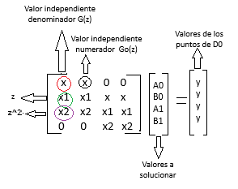
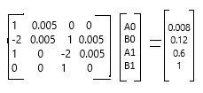

12/09/2024
# Metodos Algebraicos
## Igualación de coeficientes: 
> 🔑 ¿Qué se hace?: Se analizan los coeficientes del polinomio caracteristico.

Caracteristicas adicionales:
* Se conocen la ubicación de los polos que se desea, así que se busca la representación del polinomio caracteristico.
* Se puede obtener el C(z) Controlador que asegura el comportamiento deseado.
* Se hace una igualación coeficiente a coeficiente. 

# 💡Ejemplo 1
Si se tiene G(z) de la siguiente manera: 
$$G(z)= \frac{0.0043}{z^{2}-1.819z+0.8187}$$
Ahora bien, si se desea tener un controlador para ubicar los nuevos polos de la siguiente manera: 
$$p_{1}=0.91+0.23j; p_{2}=0.91-0.23j$$
Entonces el polinomio caracteristico, es decir, el que se desea en lazo cerrado es: 
$$(z-0.91+0.23j)(z-0.91-0.23j)= {\color{Red} z^{2}-1.82z+0.881}$$

Si en lazo cerrado $$G_{0}(z)= \frac{KG(z)}{1+KG(z)}$$, entonces se hacen los siguientes calculos: 
$$G_{0}(z)= \frac{K(\frac{0.0043}{z^{2}-1.819z+0.8187})}{1+K(\frac{0.0043}{z^{2}-1.819z+0.8187})}$$
$$G_{0}(z)=\frac{K(0.0043)}{z^{2}-1.819z+0.8187+K(0.0043)}$$

* Al igualar los coeficientes se puede observar que el termino que acompaña a las z a ambos lados del igual, son diferentes, por lo tanto no se puede realizar con acción proporcional.Entonces...

## Funciones causales(Propias) 
### Caracteristicas
* El controlador tiene que ser de un orden menor que el orden de la planta.
* Debe ser BIPROPIO.
* Se le debe agregar un polo y un zero.
* Este concepto no se aplica para funciones de primer orden.

$$G(z)=\frac{N(z)}{D(z)}; C(z)=\frac{B(z)}{A(z)}; G_{0}(z)=\frac{N_{0}(z)}{D_{0}(z)}$$
Si $$ G_{0}(z)=\frac{C(z)G(z)}{1+C(z)G(z)}\Rightarrow \frac{B(z)N(z)}{{\color{Orchid} A(z)D(z)}+{\color{Green} B(z)}N(z)}$$

* Donde A(z) y D(z) son los valores causantes de que se suba un orden. Y B(z) y A(z) son las variables a solucionar para hallar el controlador.

# 💡Ejemplo 2
Siguiendo el ejemplo 1 y teniendo un controlador que no es bipropio, sucede:
  $$C(z)=\frac{B_{0}}{A_{0}+A_{1}z}$$
  Ahora el sistema tendrá 3 polos, por lo que: $$(z-0.91+0.23j)(z-0.91-0.23j)(z-0.91)= {\color{Red} z^{3}-2.73z^{2}+2.537z-0.8017}$$
  En lazo cerrado: $$G_{0}(s)=\frac{0.0043B_{0}}{A_{1}z^{3}+z^{2}(A_{0}-1.819A_{1})+(0.8187A_{1}-1.819A_{0})z+0.8187A_{0}+0.0043B_{0}}$$
  * Resolviendo la igualdad entre ambos polinomios caracteristicos, se obtiene que NO se satisfacen todas las ecuaciones.
  * Se analiza que Número de incognitas debe ser igual a numero de ecuaciones.

# 💡Ejemplo 3
Siguiendo el ejemplo 2 y teniendo un controlador bipropio, sucede: 
  $$C(z)=\frac{B_{0}+B_{1}z}{A_{0}+A_{1}z}$$
  Ahora el sistema seguirá teniendo 3 polos, por lo que: $$(z-0.91+0.23j)(z-0.91-0.23j)(z-0.91)= {\color{Red} z^{3}-2.73z^{2}+2.537z-0.8017}$$
  En lazo cerrado: $$G_{0}(s)=\frac{0.0043(B_{0}+B_{1}z)}{A_{1}z^{3}+z^{2}(A_{0}-1.819A_{1})+(0.8187A_{1}-1.819A_{0}+0.0043B_{1})z+0.8187A_{0}+0.0043B_{0}}$$
* Resolviendo la igualdad entre ambos polinomios caracteristicos, se obtiene que A_{0}= -0.911; A_{1}= 1; B_{0}= -12.99 y B_{1}= 14.23
* Los coeficientes obtenidos satisfacen lo requerido para obtener el controlador, por ende, el controlador resulta siendo:
    $$C(z)=\frac{-12.99+14.23z}{-0.911+z}$$

# Ecuaciones Diafónticas
* Dado que lo que interesa es el polinomio caracteristico y B(z) y A(z) son las variables a solucionar, entonces se generaliza y simplifica todo con una ecuación diafóntica, en donde, D_{0} serán los puntos de la dinámica del sistema (Denominador) deseados.
* Se realiza de la siguiente manera:

Figura 1. Ecuaciones Diofanticas y su uso.

# 💡Ejemplo 4 
Se tiene $$G(z)=\frac{0.005+0.005z}{z^{2}-2z+1}; C(z)=\frac{B_{0}+B_{1}z}{A_{0}+A_{1}z}$$
Entonces en lazo cerrado sería: $$G_{0}(s)=\frac{(0.005+0.005z)(B_{0}+B_{1}z)}{(A_{0}+A_{1}z)(z^{2}-2z+1)+(B_{0}+B_{1}z)(0.005+0.005z)}$$
$$D'_{0} = A_{1}z^{3}+(A_{0}-2A_{1}+0.005B_{1})z^{2}+(A_{1}-2A_{0}+0.005B_{1}+0.005B_{0})z+A_{0}+0.005B_{0}$$
Y el polinomio deseado es $$(z+0.2)^3$$ por ende la ecuación diafóntica quedaría:

Figura 2. Ejercicio Ecuaciones diafónticas.

